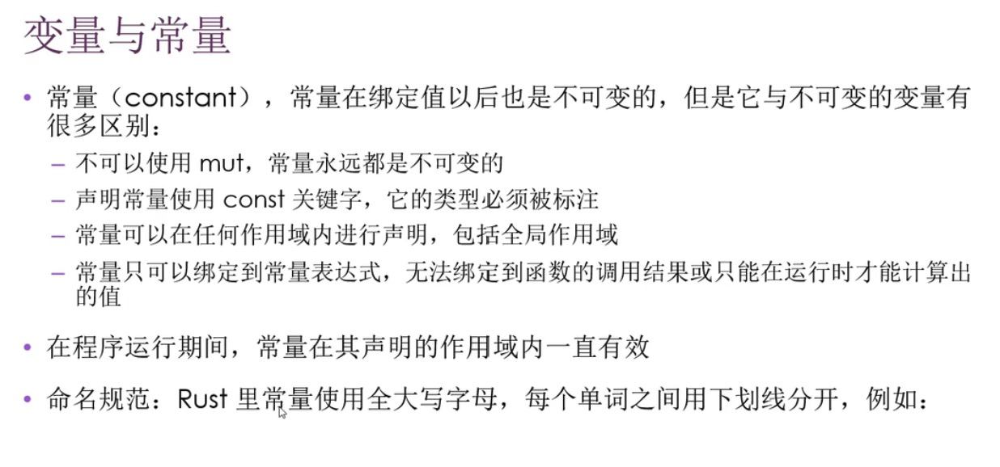
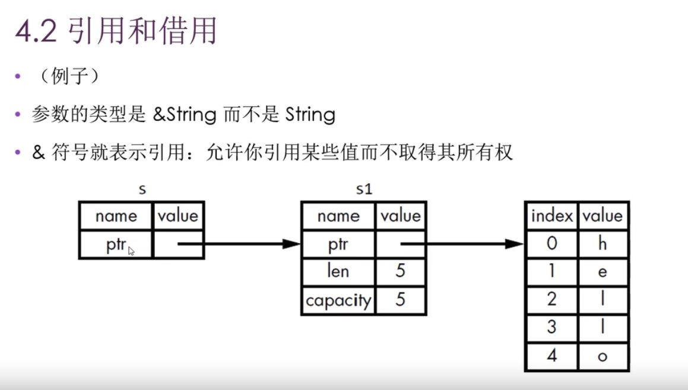

<link rel="stylesheet" type="text/css" href="auto.css" />

# Study Rust Program Book

## Get started

## guess game
### get input from stdin
```rust
    let mut guess = String::new();
    io::stdin().read_line(&mut guess).unwrap();

```
### use rand function
```rust
use rand::Rng;
let result = rand::thread_rng().gen_range(1..101);
println!("The secret number is: {result}",);
```

### 比较两个数字
```rust
        Ok(num) => match num.cmp(&result) {
            Ordering::Less => println!("Too small!"),
            Ordering::Greater => println!("Too big!"),
            Ordering::Equal => println!("You win!"),
        },
```

> 问题：
* read_line 中的变量必须要清空，或者重新定义，才不会有问题。
* https://www.jonaspauthier.com/rust-loop-through-user-inputs-in-terminal/

## 变量

### 格式化时间字符串
```rust
use chrono::{prelude::*, format::{DelayedFormat, StrftimeItems}};
fn main() {
    //
    let fmt = "%Y-%m-%d %H:%M:%S";
    //
    let now: DateTime<Local> = Local::now();
    let dft: DelayedFormat<StrftimeItems> = now.format(fmt);
    let str_date: String = dft.to_string(); // 2021-01-04 20:02:09
    println!("now: {}", str_date);
}
```

### 常量



```rust
//const_format="0.2.22"
use const_format::concatcp;

const NAME: &str = "Bob";
const FOO: &str = concatcp!(NAME, ", age ", 21u8,"!");

assert_eq!(FOO, "Bob, age 21!");
```

## 所有权



## 迭代器